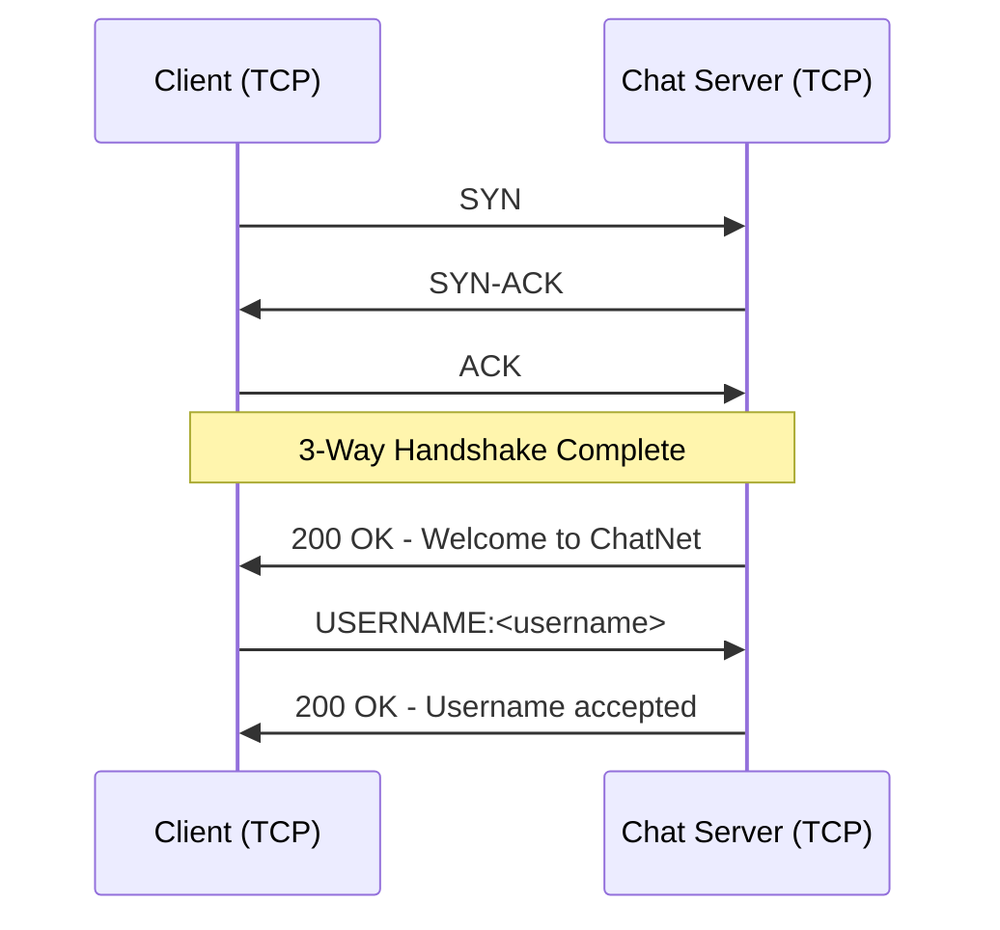
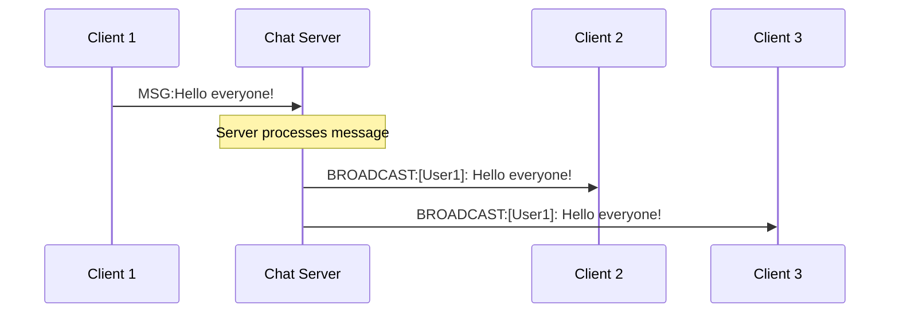
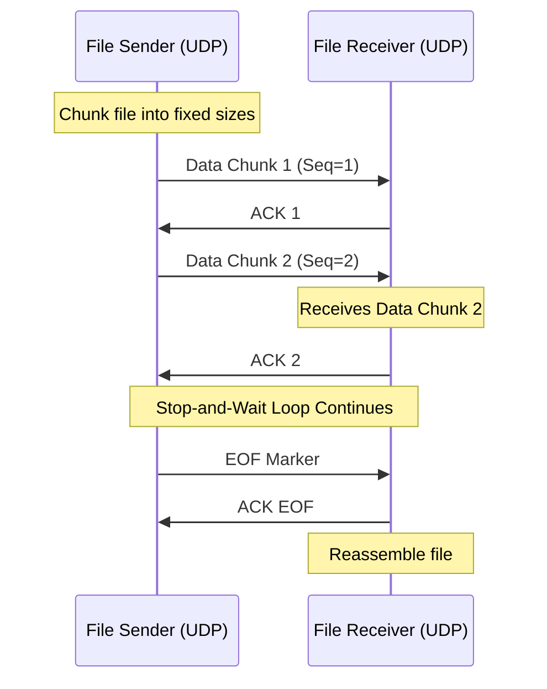
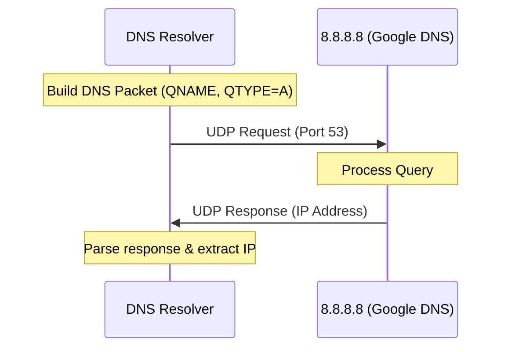
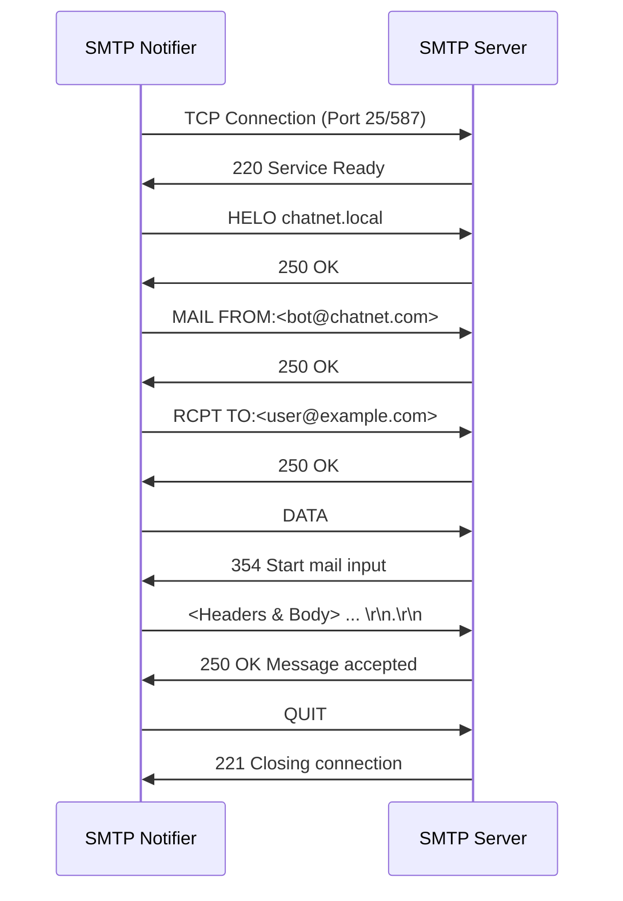
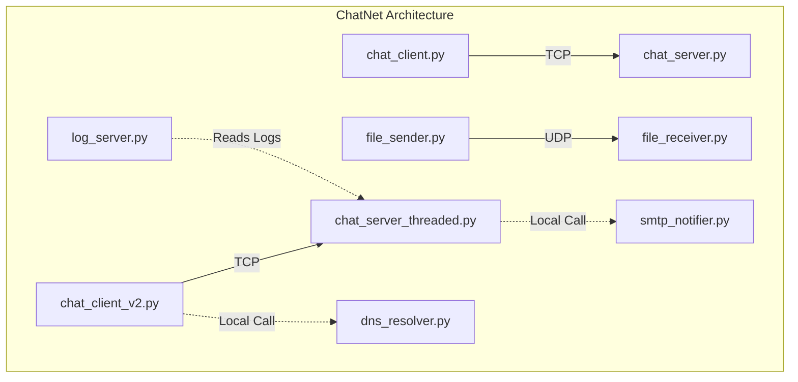
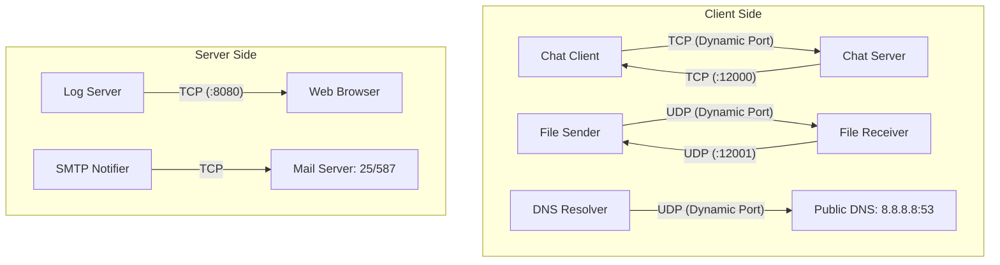
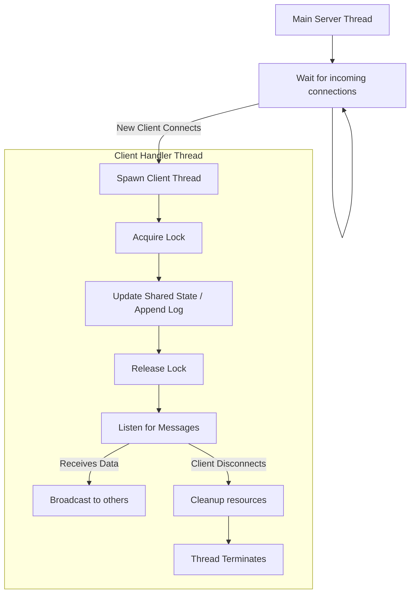

# Section 1 — Planning & Modelling

## Requirements Analysis + Use Case Diagram

The ChatNet system is designed to provide real-time multi-client communication with additional features like file transfer via UDP, domain name resolution, HTTP-based chat logging, and email notifications via SMTP. The requirements dictate a distributed architecture with multiple interacting modules.

```mermaid
usecaseDiagram
    actor User as "Client User"
    actor Admin as "System Admin"
    
    package "ChatNet System" {
        usecase UC1 as "Connect to Server"
        usecase UC2 as "Send/Receive Messages"
        usecase UC3 as "Transfer Files (UDP)"
        usecase UC4 as "Resolve Hostname (DNS)"
        usecase UC5 as "Receive @mention Email (SMTP)"
        usecase UC6 as "View Logs (HTTP)"
    }
    
    User --> UC1
    User --> UC2
    User --> UC3
    User --> UC4
    User --> UC5
    Admin --> UC6
```

## Sequence Diagrams

### 1. TCP Connection Setup


### 2. Message Broadcast


### 3. UDP File Transfer


### 4. DNS Query


### 5. SMTP Handshake


# Section 2 — System Architecture

## Component Diagram


## Socket Interface Diagram


## Thread Model Diagram


# Section 3 — Delay Calculations

*Note: Replace placeholders with measured values from the running system.*

- **Transmission delay**: `d_trans = L/R`
  *(Calculation details based on packet length `L` and link bandwidth `R`)*
- **Propagation delay**: `d_prop = d/s`
  *(Calculation based on distance `d` and propagation speed `s`)*
- **Processing delay**: `[MEASURED/ESTIMATED VALUE]` ms
  *(Estimated time taken by server to process the packet header)*
- **Store-and-forward**: `d_end-end = N × (L/R)`
  *(Total delay assuming `N` links)*
- **Traffic intensity**: `La/R`
  *(Calculation based on an average arrival rate `a` under 5-client load)*
- **RTT from /ping vs. theoretical propagation delay**: 
  *(Compare and explain the gap, e.g., operating system scheduling, thread switching overhead, processing delays)*

# Section 4 — Implementation Screenshots

*Insert real terminal/browser captures below:*

1. **Server startup** (showing IP and port)
   `[INSERT SCREENSHOT HERE]`
2. **Multi-client chat session** (3+ clients visible)
   `[INSERT SCREENSHOT HERE]`
3. **`/ping` output** with RTT values
   `[INSERT SCREENSHOT HERE]`
4. **`/throughput` output** with kbps result
   `[INSERT SCREENSHOT HERE]`
5. **UDP file transfer** progress log (Packet X/Y sent... ACK received)
   `[INSERT SCREENSHOT HERE]`
6. **DNS resolution** terminal output
   `[INSERT SCREENSHOT HERE]`
7. **Browser showing `/chatlog`** rendering 50 messages
   `[INSERT SCREENSHOT HERE]`
8. **Email inbox** confirming received SMTP notification
   `[INSERT SCREENSHOT HERE]`

# Section 5 — Test Cases

| TC | Module | Input | Expected Output |
|----|--------|-------|-----------------|
| TC-01 | TCP Server | Valid client connects | 200 OK + welcome message |
| TC-02 | TCP Server | Duplicate username | 409 Conflict rejection |
| TC-03 | UDP Transfer | Send 1 KB file | File received intact |
| TC-04 | UDP Transfer | Simulated ACK timeout | Retransmission triggered |
| TC-05 | DNS Resolver | google.com | Valid IPv4 address returned |
| TC-06 | DNS Resolver | Invalid hostname | Error message displayed |
| TC-07 | HTTP Log Server | GET /chatlog | 200 OK + HTML response |
| TC-08 | HTTP Log Server | GET /unknown | 404 Not Found |
| TC-09 | SMTP Notifier | Valid @mention | Email delivered to inbox |
| TC-10 | SMTP Notifier | Invalid recipient email | SMTP 550 error handled gracefully |
